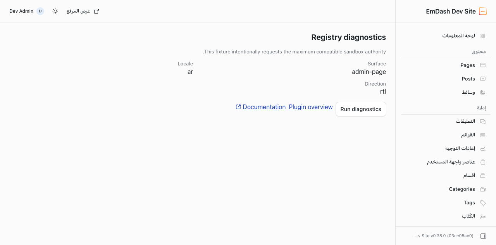

# Marketplace Test Plugin

This package is EmDash's maximal registry-installed sandbox fixture. It deliberately combines every current capability and extension surface that can coexist in one plugin. The result is a diagnostic grab bag, not an example product.

The plugin test host builds this package, loads its generated manifest and bundle through Worker Loader, and exercises it through the production runtime. Changes to the capability vocabulary, hook names, or `PluginContext` methods fail the inventory test until this fixture records a covered or excluded decision.

## Authority matrix

The source manifest uses canonical capability names. The generated manifest closes capability implications before the runtime loads it.

| Capability                       | Fixture coverage                                                                                 |
| -------------------------------- | ------------------------------------------------------------------------------------------------ |
| `network:request`                | Implied by unrestricted network access; `http-roundtrip` preserves binary requests and responses |
| `network:request:unrestricted`   | Declared; deterministic responses come from the runtime test host                                |
| `content:read`                   | Get, list, translations, public URLs, and cursor pagination                                      |
| `content:revisions:read`         | Revision listing and retained revision reads                                                     |
| `content:write`                  | Create, update, trash, translations, save rejection, and hook re-entry fencing                   |
| `content:publish`                | Versioned publish, unpublish, schedule, and unschedule, including stale revisions                |
| `content:restore`                | Versioned trashed reads and restore                                                              |
| `comments:read`                  | Get, list, count, personal-data shape, and trashed-comment exclusion                             |
| `comments:moderate`              | Expected-status moderation, conflicts, origin, and recursion fencing                             |
| `schema:read`                    | Collection listing and collection-with-fields lookup                                             |
| `hooks.content-policy:register`  | Publish, schedule, and unpublish policy for API, MCP, plugin, and scheduler origins              |
| `taxonomies:read`                | Definitions, terms, and entry assignments                                                        |
| `taxonomies:write`               | Term creation plus idempotent assignment additions and removals                                  |
| `redirects:read`                 | Cursor listing and versioned reads                                                               |
| `redirects:write`                | Create, update, delete, conflict, loop validation, and host-owned field denial                   |
| `media:read`                     | Metadata lookup and listing without storage keys                                                 |
| `media:bytes:read`               | Bounded bytes and content hashes                                                                 |
| `media:metadata:write`           | Alt, caption, and complete focal-point updates                                                   |
| `media:write`                    | Direct byte upload and deletion                                                                  |
| `users:read`                     | ID, email, and paged directory reads                                                             |
| `email:send`                     | Delivery through the runtime's deterministic transport                                           |
| `hooks.email-transport:register` | Exclusive delivery hook declaration and direct hook transport                                    |
| `hooks.email-events:register`    | Before-send and after-send hooks                                                                 |
| `hooks.page-fragments:register`  | Declaration and manifest round-trip only; sandbox registration is excluded below                 |

The fixture also covers plugin-scoped storage CRUD, indexed queries, batches, conditional updates, revisions and stale compare-and-set operations; the corresponding KV and settings revision APIs; encrypted secret persistence and rotation; cron schedule/list/cancel; all logger methods; site and URL context; and lifecycle restart persistence.

## Hooks and routes

The fixture declares every name in `HOOK_NAMES`:

- install, activate, deactivate, and uninstall lifecycle hooks;
- before/after content save and delete hooks;
- publication policy and every post-publication state hook;
- before/after media upload hooks;
- before-create, initial-moderation, after-create, and after-moderate comment hooks;
- email event and exclusive transport hooks;
- cron and page metadata hooks; and
- the trusted-only page-fragment hook, whose sandbox exclusion is tested.

Routes use every declared body mode (`none`, `json`, `text`, `bytes`, and `form-data`), every supported HTTP method, JSON and raw responses, declared request headers, private permissions, public consent, and public cache policy. Runtime tests cover authorization, CSRF, method rejection and `Allow`, byte limits, content-type restrictions, safe response headers, and unsafe resource denial. Two Zod-backed MCP tools cover structured input/output metadata, read-only diagnostics, destructive consent, route permission transport, and installed registry consent.

The `diagnostics` route reports which context authorities reached the isolate. Domain routes expose deterministic operations for content, schema, taxonomies, redirects, comments, media, users, email, storage, KV, settings, cron, network, and logging.

## Admin surfaces

The package declares two pages, two dashboard widgets, a saved-entry panel, confirmed and invalid saved-entry actions, every generated settings field type, and a declarative field widget using every supported field-widget element.

The `/components` page renders every block accepted by the production validator, including tabs, plus every admin form element. The runtime suite loads it in Arabic and verifies the host-attested `ar` locale and `rtl` direction. Saved-entry tests verify host-reloaded identity, ownership checks, invalid response isolation, refresh/navigation bounds, and failure isolation.



The screenshot uses the Node E2E fixture at `/plugins/marketplace-test/overview`, a 1280×720 viewport, the Arabic locale, and the light theme.

## Deliberate exclusions

These surfaces cannot be exercised as ordinary successful operations in the same built plugin:

- **Host-restricted network access.** The plugin manifest validator rejects a non-empty `allowedHosts` list when `network:request:unrestricted` is declared. The maximal fixture keeps unrestricted access. Reduced-manifest tests in core and both bridges cover host allowlists, redirects, SSRF, and credential stripping.
- **Sandboxed page fragments.** The shared manifest accepts `page:fragments`, but the sandbox proxy drops it before hook registration. The fixture declares it to protect the manifest round-trip and the host-wiring suite proves that it does not register.
- **Authoring-only elements.** `repeater` and `media_picker` are part of the shared element vocabulary, but the runtime Block Kit renderer intentionally emits no DOM for them in sandbox admin forms. The fixture covers `media_picker` through the declarative field-widget surface and records `repeater` as authoring-only.
- **Presigned media uploads.** The shared media interface includes `getUploadUrl()` for trusted plugins, but sandbox wrappers reject it and require bounded direct byte uploads through `media.upload()`. The type inventory records this method as excluded while the runtime suite exercises direct upload and deletion through R2.
- **Native surfaces.** React admin code, Astro components, custom Portable Text blocks, page fragments, host bindings, Node built-ins, sockets, and direct database access require a trusted native plugin.
- **Live external systems.** Network and email behavior use deterministic host responders and transports. The fixture never calls a live service.
- **npm changesets.** `@emdash-cms/plugin-marketplace-test` is private and listed in `.changeset/config.json`'s ignored packages. Its package `CHANGELOG.md` records fixture revisions; a release changeset would be invalid and misleading.

## Verification

Run the fixture and production-boundary suites from the repository root:

```sh
pnpm --dir packages/plugins/marketplace-test typecheck
pnpm --dir packages/plugins/marketplace-test build
pnpm --dir packages/plugin-test test
pnpm --dir packages/workerd test
pnpm --dir packages/cloudflare test
```

The main evidence lives in `packages/plugin-test/test/host.test.ts` and `packages/plugin-test/test/registry-inventory.test.ts`. Core's sandbox host, route, consent, registry installation, redaction, and implication suites cover reduced-authority and cross-plugin denial cases that the maximal manifest cannot represent.
